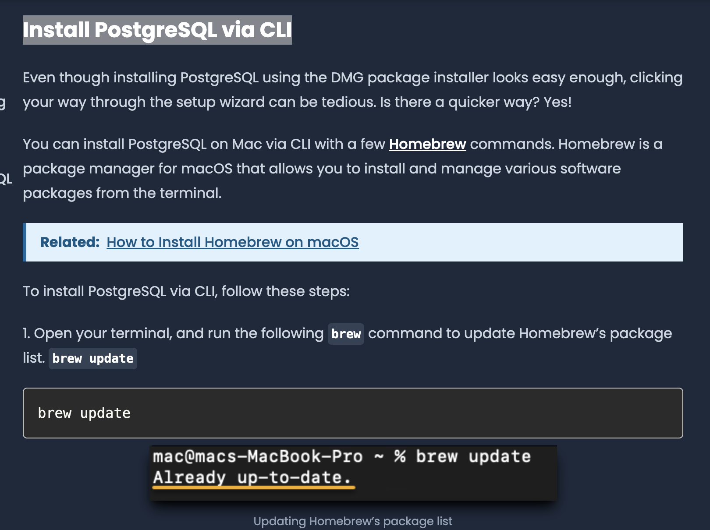
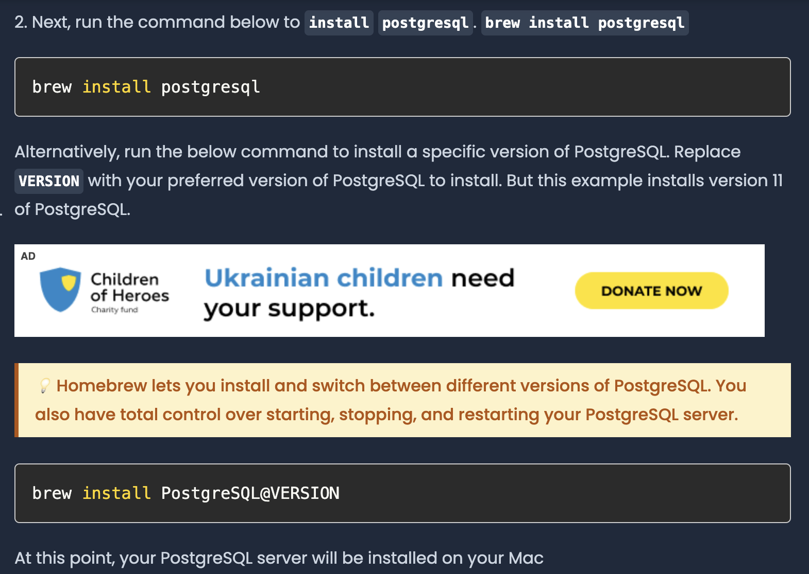
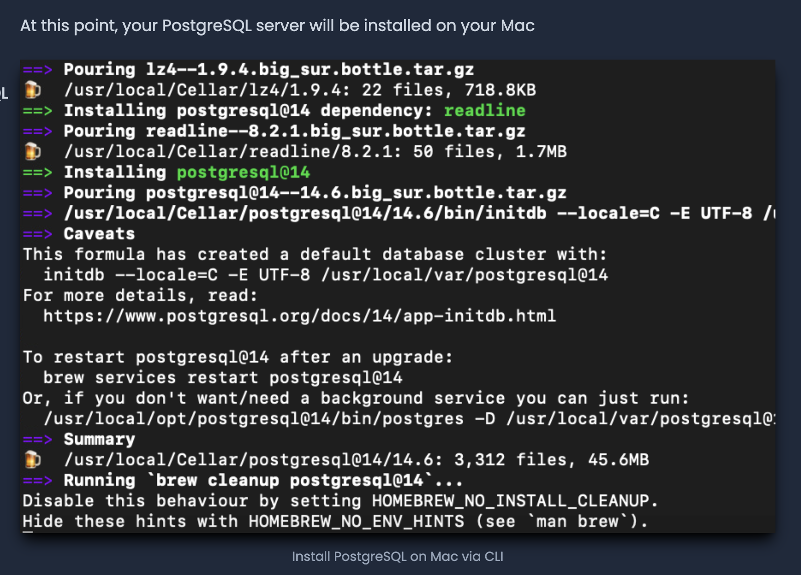
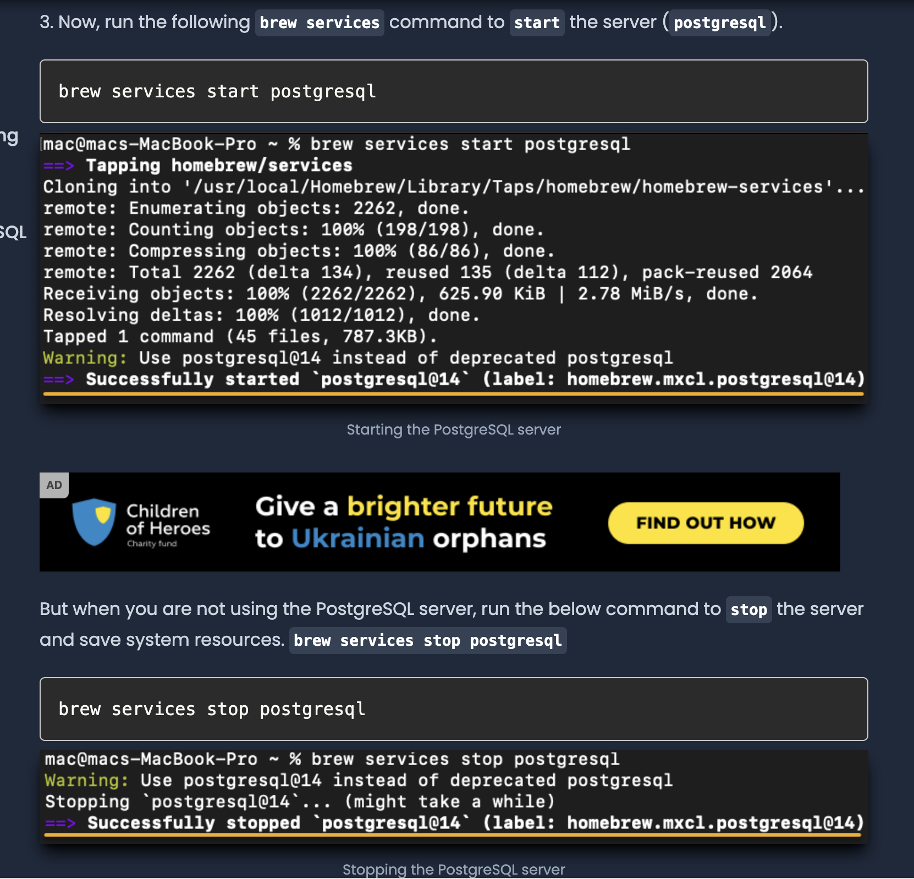
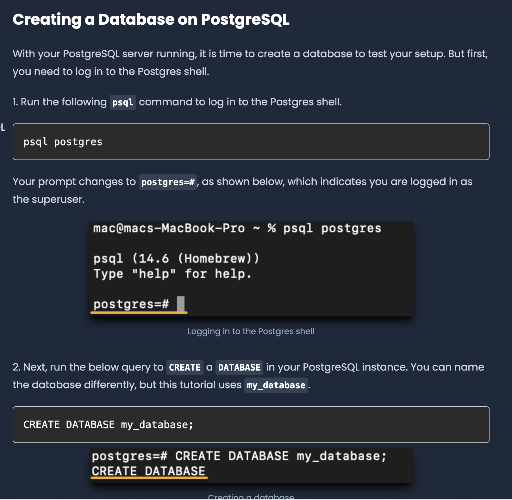
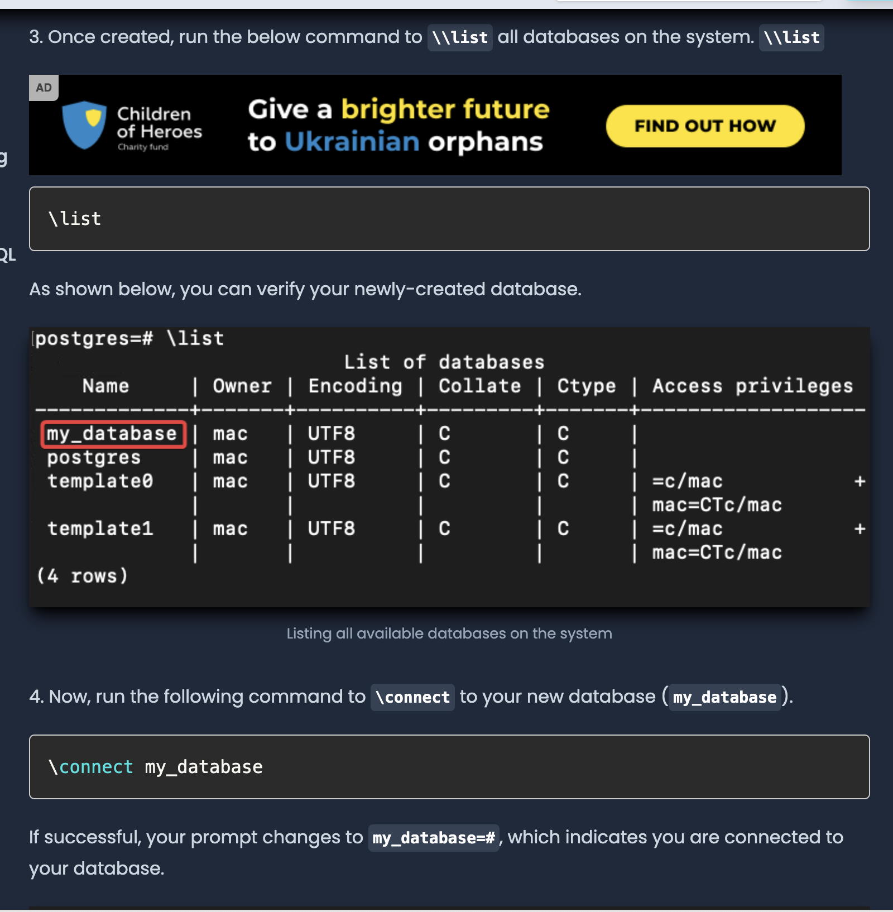
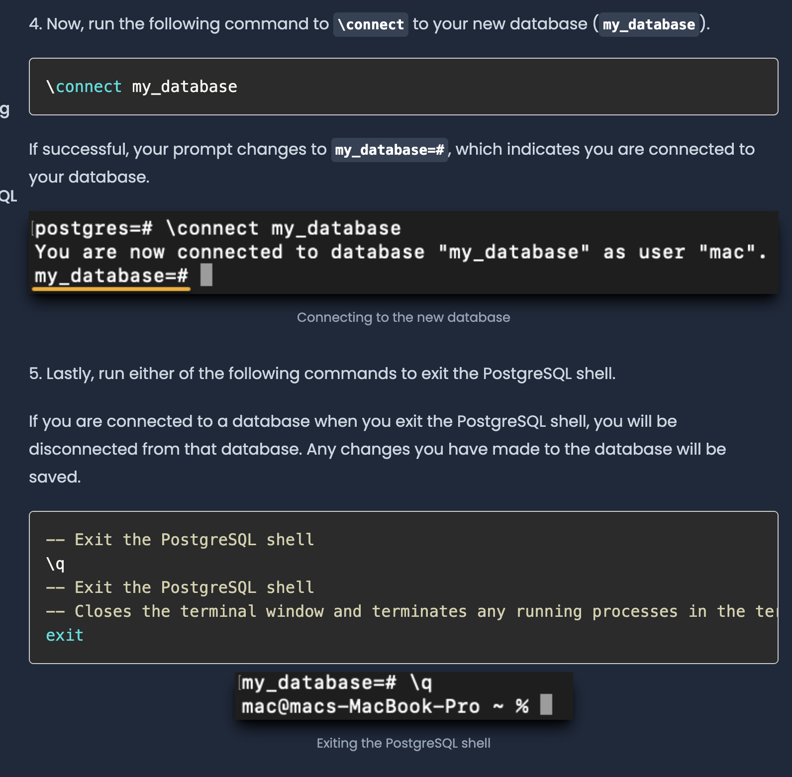

# Creating a Database Access Object

Hello! We will be creating a special type of service; a Database Access Object!

Like its name suggest, this is an object which allows us to access a database.

Now the smart parrots might ask:

How does a database access object look like?

A: Here you go!

In the bottom, we define a data model class, representing a Pirate Parrot object.

Note: This is not the database access object yet! This is just the data model that the DAO is responsible to store / read from the database.

A pirate parrot has two attributes: a name and a weapon.

```python3
class PirateParrot:
    """
    A data model representing a Pirate Parrot
    """
    def __init__(self, name: str, weapon: str):
        self.name = name
        self.weapon = weapon
```

And here is the database access object :D

It is responsible for getting and inserting pirate parrots from and into a database.

```python3
class PirateParrotDAO:
    """
    A database access object
    Allows us to get and insert pirate parrots from and into a database
    """
    def get_all_pirate_parrots(self) -> list[PirateParrot]:
        pass

    def insert_pirate_parrot(self, pirate_parrot: PirateParrot) -> None:
        pass
```

Now the parrots might ask:

Q: What database are we using?

A: Lets start off with one of the most commonly used database; PostgreSQL

## First (big) Prerequisite - A crash course on PostgreSQL (A table database to read and store data)

Q: What is the PostgreSQL?

A: Lets keep it simple for now, and say the database is a table-like database which stores data like this:

```
Table: `pirate_parrots`
+-----------------+-----------------+
| name            | weapon          |
+-----------------+-----------------+
| Captain Hook    | Hook            |
| Blackbeard      | Cutlass         |
| Long John Silver| Cutlass         |
| Jack Sparrow    | Cutlass         |
| Captain Barbossa| Cutlass         |
+-----------------+-----------------+
```

Now you smart parrots might ask:

Q: Hmm okay, but how do we setup a PostgreSQL database?

A: A PostgreSQL database is a database server! Just like how we are able to host our own servers locally on our computer, we are able to download some files / software which will allow us to spin up a PostgreSQL database locally on our computer as well!

Q: How do we do that?

A: Please follow the instructions here :D 

**Install PostgreSQL via CLI**
- https://adamtheautomator.com/install-postgresql-on-mac/

**Install Brew here if you are new to it**

```commandline
/bin/bash -c "$(curl -fsSL https://raw.githubusercontent.com/Homebrew/install/HEAD/install.sh)"
```

**Update brew; a package manager for macOS**

```commandline
brew update
```



**Install PostgreSQL with brew**

```commandline
brew install postgresql
```




**Start the PostgreSQL server with brew services; a service manager for macOS**

Now, we have all the files we need to host our PostgreSQl server!

We can start the server by running the following command:

```commandline
brew services start postgresql@14
==> Successfully started `postgresql@14` (label: homebrew.mxcl.postg
```



Now you smart parrots might ask:

**Q: How do we connect to the database?**

```bash
// Connects to our locally hosted postgreSQL database server at port 5432
psql postgres
```

In postgres, we organize our data into databases.

Databases are like folders, which contain tables.

We can create a database by running the following command:

```bash
// Creates a database called `pirate_database`
CREATE DATABASE pirate_database;
```



**Q: How do we validate that our database is created?**

A: We can use `\list` to list all the databases we have created.

```bash
// Lists all the databases we have created
\list
```

Q: How do we connect to our newly created database?

A: Use `\connect pirate_database` to connect to our newly created database.

```bash
\connect pirate_database
```




**Q: Alright, lets create a table for our PirateParrot! How do we do that?**

```sql
CREATE TABLE pirate_parrots (
    name VARCHAR(255) NOT NULL,
    weapon VARCHAR(255) NOT NULL
);
```

**Q: How do we insert a parrot into the `pirate_parrot` table?**

```sql
INSERT INTO pirate_parrots (name, weapon) VALUES ('Captain Hook', 'Hook');
```

**Q: How do we query all the pirate parrots from the `pirate_parrot` table?**

```sql
SELECT * FROM pirate_parrots;
```

**Q: How do we query for one specific pirate parrot whose name is "Captain Hook"?

```sql
SELECT * FROM pirate_parrots WHERE name = 'Captain Hook';
```

And there we go!

We have done a quick crash course on 

- how to install PostgreSQL on our local machine
- how to create a database
- create a table
- insert data into a table
- query data from a table.

**Q: Alright! What if i want to exit my command-line client to my PostgreSQL database?**

A: We can use `\q`

```commandline
// Exits the command-line client to our PostgreSQL database
\q
```



## Implementing the `PirateParrotDAO`

Alright! Now that we have done the following:

- PostgreSQL installed
- PostgreSQL database server running at `localhost:5432` (port 5432)
- database `pirate_database` created
- a table `pirate_parrots` created

```sql
CREATE TABLE pirate_parrots (
    name VARCHAR(255) NOT NULL,
    weapon VARCHAR(255) NOT NULL
);
```

- how to insert a parrot into the database

```sql
INSERT INTO pirate_parrots (name, weapon) VALUES ('Captain Hook', 'Hook');
```

- how to read a parrot from the database
- 
```sql
SELECT * FROM pirate_parrots;
```

- how to read a specific parrot from the database

```sql
SELECT * FROM pirate_parrots WHERE name = 'Captain Hook';
```

we can start implementing our `PirateParrotDAO`!

```python3
class PirateParrotDAO:
    """
    A database access object
    Allows us to get and insert pirate parrots from and into a database
    """
    def get_all_pirate_parrots(self) -> list[PirateParrot]:
        pass

    def insert_pirate_parrot(self, pirate_parrot: PirateParrot) -> None:
        pass
```

Now you smart parrots might ask:

**Q: Hmm, i would guess we already have a library for reading and writing to a PostgreSQL database.**

A: Yes! We do! It is called `psycopg2`!

**Q: How do we install it?**

A: We can install it via pip!

pip is a package manager for python.

```commandline
// create a virtual environment. This will store dependencies for this project
virtualenv venv -p $(which python3.9)

// Activate the virtual environment
source venv/bin/activate

// Install psycopg2
pip install psycopg2

// Alternative, if you are using macos with apple silicon, use the binary
pip install psycopg2-binary
``` 

Now that we have it, we can start implementing our `PirateParrotDAO`!

```python3
import psycopg2
from psycopg2._psycopg import cursor


class PirateParrot:
    """
    A data model representing a Pirate Parrot
    """

    def __init__(self, name: str, weapon: str):
        self.name = name
        self.weapon = weapon

    def __str__(self) -> str:
        return f"{self.name} has a {self.weapon}"


class PirateParrotDAO:
    def __init__(
        self,
        database: str = "pirate_database",
        user: str = "",
        password: str = "",
        host: str = "localhost",
        port: int = 5432,
    ):
        self.database_connector = psycopg2.connect(
            database=database, user=user, password=password, host=host, port=port
        )

    def get_all_pirate_parrots(self) -> list[PirateParrot]:
        # Create a cursor to execute queries
        my_pirate_cursor: cursor = self.database_connector.cursor()

        # execute a query to get all the pirate parrots
        # this loads the results into the cursor
        my_pirate_cursor.execute(query="SELECT name, weapon FROM pirate_parrots")

        # fetch all results from the cursor
        rows: list[tuple[str]] = my_pirate_cursor.fetchall()
        pirate_parrots: list[PirateParrot] = []

        # for each row, create a PirateParrot object and add it to the list
        for row in rows:
            pirate_name: str = row[0]
            pirate_weapon: str = row[1]
            pirate_parrot: PirateParrot = PirateParrot(
                name=pirate_name, weapon=pirate_weapon
            )
            pirate_parrots.append(pirate_parrot)
        return pirate_parrots

    def insert_pirate_parrot(self, pirate_parrot: PirateParrot) -> None:
        # Create a cursor to execute queries
        cursor = self.database_connector.cursor()

        # execute an INSERT to add a pirate parrot to the database
        # this is not executed till we commit the changes
        cursor.execute(
            "INSERT INTO pirate_parrots (name, weapon) VALUES (%s, %s)",
            (pirate_parrot.name, pirate_parrot.weapon),
        )
        # commit the INSERT to the database
        self.database_connector.commit()


if __name__ == "__main__":
    # initialize the PirateParrotDAO
    # this is the object that will be used to interact with the database
    pirate_parrot_dao: PirateParrotDAO = PirateParrotDAO()

    # create a pirate parrot object, ready to be inserted into the database
    my_first_parrot: PirateParrot = PirateParrot(
        name="Captain Jack Sparrow", weapon="Cutlass"
    )

    # insert the pirate parrot to the database
    pirate_parrot_dao.insert_pirate_parrot(pirate_parrot=my_first_parrot)

    # we should be able to get Captain Jack Sparrow from the database now
    pirate_parrots: list[PirateParrot] = pirate_parrot_dao.get_all_pirate_parrots()

    for index, pirate_parrot in enumerate(pirate_parrots):
        print(f"parrot: {index}")
        print(f"pirate_parrot.name: {pirate_parrot.name}")
        print(f"pirate_parrot.weapon: {pirate_parrot.weapon}")
```

Running the code should give us the following output:

```commandline
(venv) ➜  assignment_3_creating_a_database_access_object git:(master) ✗ python3 answer.py
parrot: 0
pirate_parrot.name: Captain Jack Sparrow
pirate_parrot.weapon: Cutlass
```